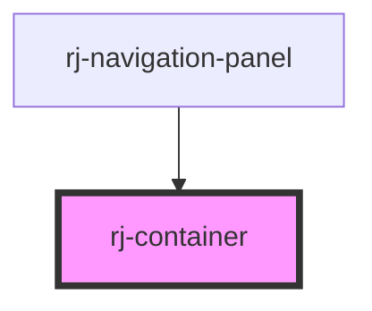

# rj-container

<!-- Auto Generated Below -->

## Properties

| Property    | Attribute    | Description | Type      | Default |
| ----------- | ------------ | ----------- | --------- | ------- |
| `fullWidth` | `full-width` |             | `boolean` | `false` |

## Dependencies

### Used by

 - [rj-navigation-panel](../rj-navigation-panel)

### Graph

----------------------------------------------

*Built with [StencilJS](https://stenciljs.com/)*
