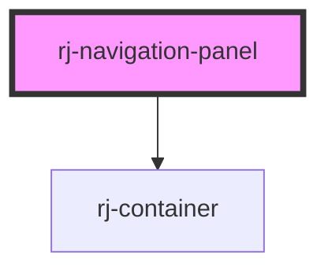

# rj-navigation-panel

<!-- Auto Generated Below -->

## Properties

| Property                | Attribute    | Description | Type      | Default     |
| ----------------------- | ------------ | ----------- | --------- | ----------- |
| `appTitle` _(required)_ | `app-title`  |             | `string`  | `undefined` |
| `fullWidth`             | `full-width` |             | `boolean` | `false`     |

## Dependencies

### Depends on

- [rj-container](../rj-container)

### Graph

----------------------------------------------

*Built with [StencilJS](https://stenciljs.com/)*
